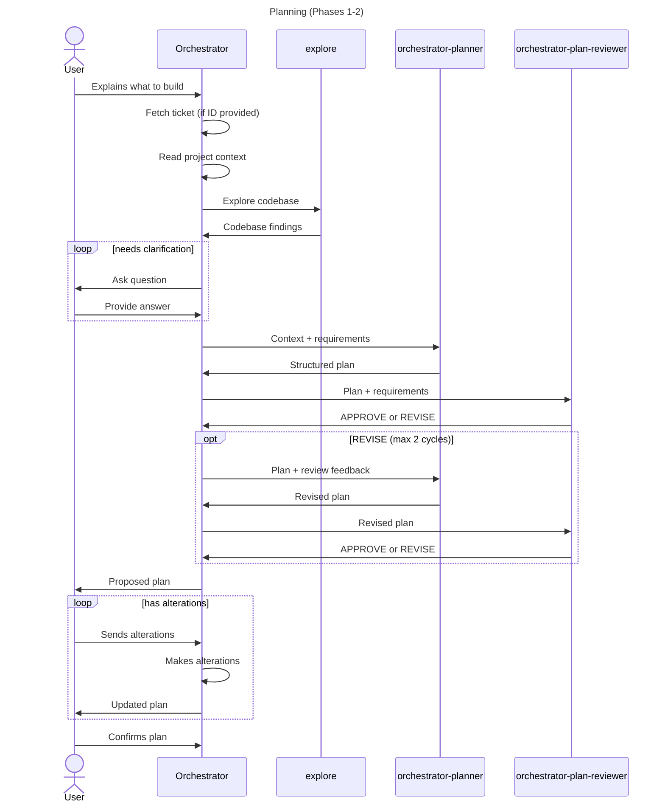
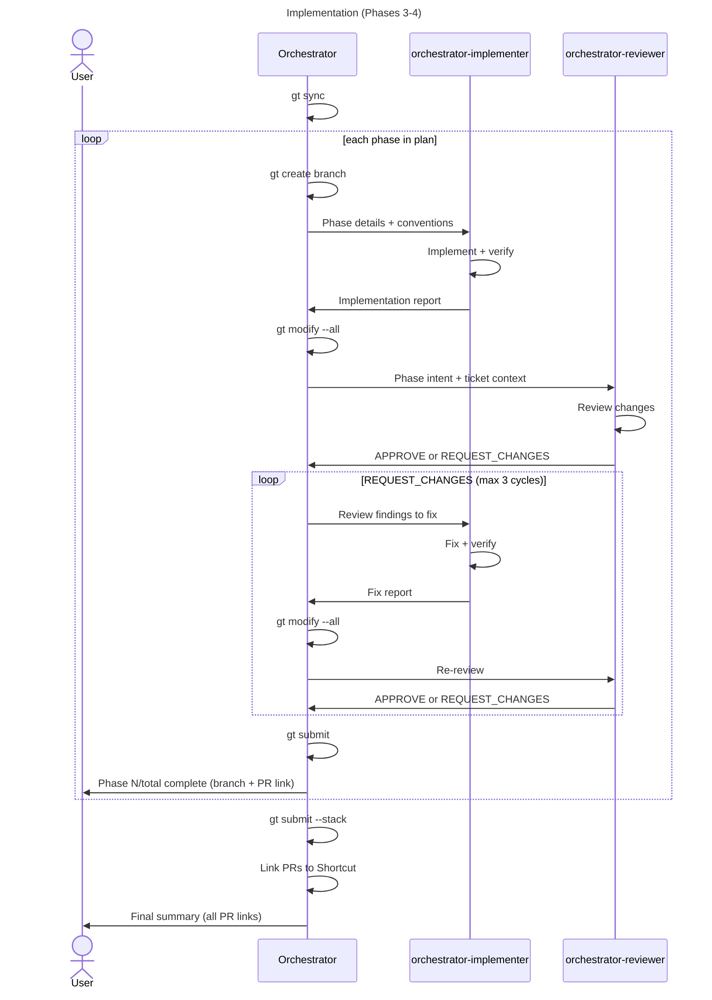

# Orchestrator Architecture

## Overview

The orchestrator delegates all work to specialized sub-agents via flat
delegation — the orchestrator is always the caller, sub-agents return
results to it, and it manages flow control, branch operations, and
user communication.

```
orchestrator (primary)
  |-- explore                      (Phase 1: codebase discovery)
  |-- orchestrator-planner         (Phase 2: create plan)
  |-- orchestrator-plan-reviewer   (Phase 2: review plan)
  |
  +-- per phase in Phase 3:
      |-- orchestrator-implementer (implement + verify)
      |-- orchestrator-reviewer    (code review)
      +-- orchestrator-implementer (fix if needed, max 3 cycles)
```

## Agents

| Agent                        | Mode             | Permissions                        | Purpose                                           |
| ---------------------------- | ---------------- | ---------------------------------- | ------------------------------------------------- |
| `orchestrator`               | primary          | no edit/write, bash: gt/git only   | Coordinates the full flow across all phases        |
| `orchestrator-planner`       | subagent, hidden | read-only, bash: git log only      | Produces structured implementation plans           |
| `orchestrator-plan-reviewer` | subagent, hidden | read-only, no bash                 | Reviews plans for feasibility and scoping          |
| `orchestrator-implementer`   | subagent, hidden | full access (edit, write, bash)    | Implements a single phase/PR and runs verification |
| `orchestrator-reviewer`      | subagent, hidden | read-only, bash: git diff/log/show | Reviews code changes, produces structured report   |

## Commands

| Command      | Phases    | Description                                          |
| ------------ | --------- | ---------------------------------------------------- |
| `/forge`     | 1-2-3-4   | Full flow: discovery, planning, implementation, done |
| `/plan`      | 1-2       | Discovery and planning only (no code changes)        |
| `/implement` | 3-4       | Implementation and completion (needs approved plan)  |

## Planning



## Implementation


