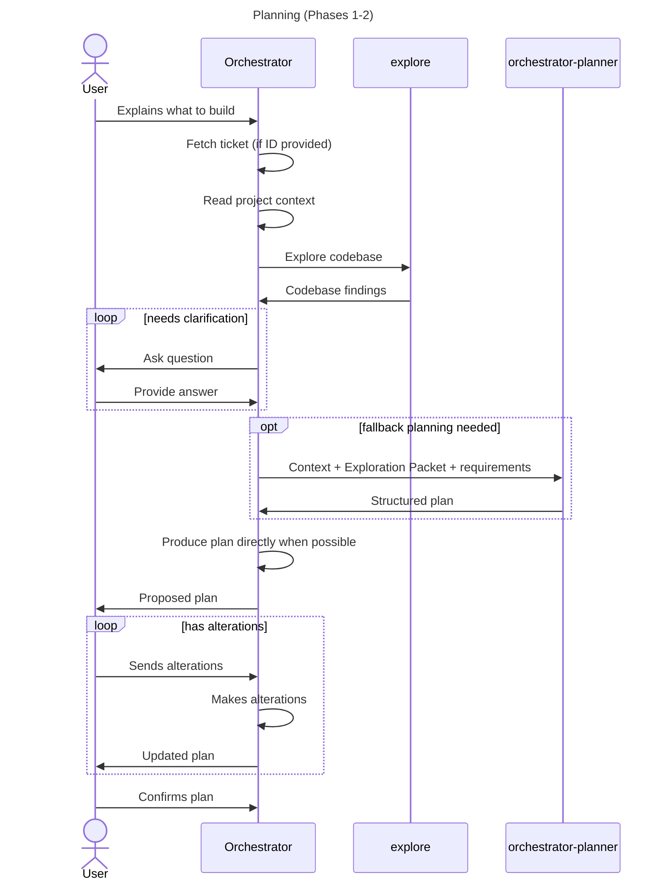
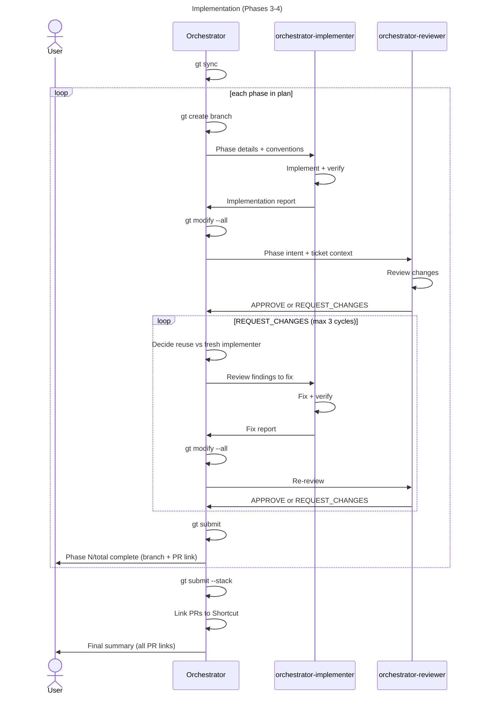

# Orchestrator Architecture

## Overview

The orchestrator owns the live working state. It handles discovery,
planning, flow control, branch operations, and user communication, and
delegates narrow execution and review tasks to specialized sub-agents.

```
orchestrator (primary)
  |-- explore                      (Phase 1: codebase discovery)
  |
  +-- per phase in Phase 3:
      |-- orchestrator-implementer (implement + verify)
      |-- orchestrator-reviewer    (code review)
      +-- orchestrator-implementer (fix if needed; reuse or refresh, max 3 cycles)
  |
  +-- orchestrator-planner         (fallback planning/replanning)
```

## Agents

| Agent                        | Mode             | Permissions                        | Purpose                                           |
| ---------------------------- | ---------------- | ---------------------------------- | ------------------------------------------------- |
| `orchestrator`               | primary          | no edit/write, bash: gt/git only   | Coordinates the full flow across all phases        |
| `orchestrator-planner`       | subagent, hidden | read-only, bash: git log only      | Fallback planning/replanning for complex tasks     |
| `orchestrator-implementer`   | subagent, hidden | full access (edit, write, bash)    | Implements a single phase/PR and runs verification |
| `orchestrator-reviewer`      | subagent, hidden | read-only, bash: git diff/log/show | Reviews code changes, produces structured report   |

## Commands

| Command      | Phases    | Description                                          |
| ------------ | --------- | ---------------------------------------------------- |
| `/forge`     | 1-2-3-4   | Full flow: discovery, planning, implementation, done |
| `/plan`      | 1-2       | Discovery and planning only (no code changes)        |
| `/implement` | 3-4       | Implementation and completion (needs approved plan)  |

## Planning

The orchestrator converts exploration results into a structured
Exploration Packet and uses it to produce the implementation plan
directly. If a task is unusually large or noisy, the orchestrator may
delegate a fallback planning pass to `orchestrator-planner`.



## Implementation



## Handoff Rules

- Use a full packet once, then prefer delta handoffs for fix cycles.
- Keep the orchestrator's working context compact.
- Treat immutable phase artifacts as snapshots, not shared scratchpads.
