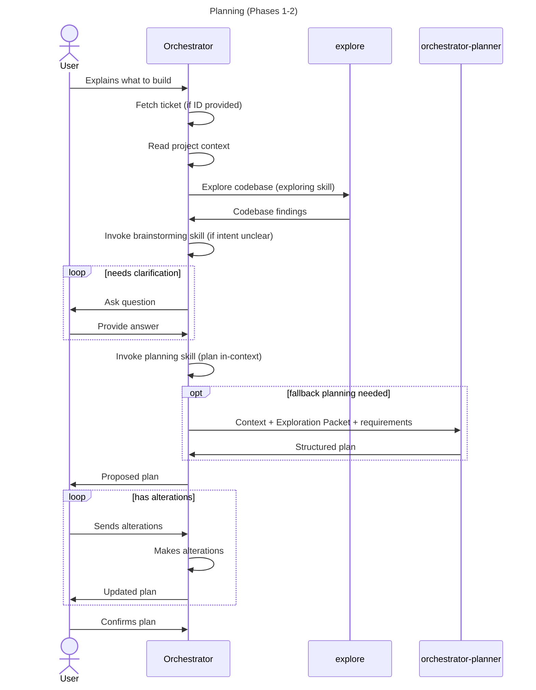
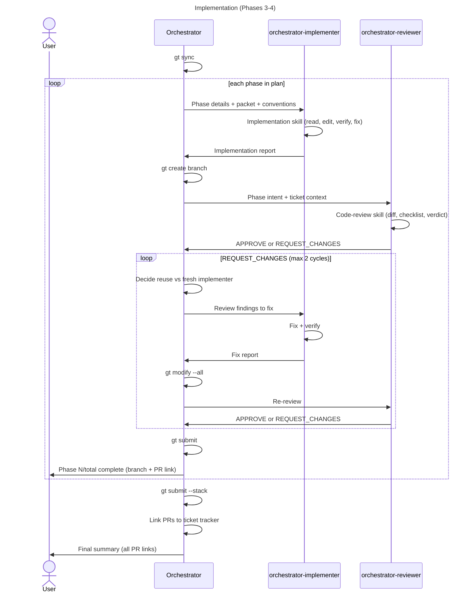

# Orchestrator Architecture

## Overview

The architecture has three layers:

- **Skills** — portable markdown describing *how* to do specific work well (methodology, checklists, output formats). Live in `skills/<name>/SKILL.md`.
- **Agents** — OpenCode-specific execution profiles (model, permissions, context isolation). Live in `agents/<name>.md`. Each agent loads one or more skills on entry.
- **Commands** — entry points that route to an agent. Live in `commands/<name>.md`.

The orchestrator owns the live working state. It handles discovery, planning, flow control, branch operations, and user communication, and delegates narrow execution and review tasks to specialized sub-agents.

```
orchestrator (primary, loads `orchestrating-stacked-prs` skill)
  |-- explore                      (Phase 1: codebase discovery)
  |
  +-- per phase in Phase 3:
      |-- orchestrator-implementer (loads `implementation` skill)
      |-- orchestrator-reviewer    (loads `code-review` skill)
      +-- orchestrator-implementer (fix if needed; max 2 review cycles)
  |
  +-- orchestrator-planner         (loads `planning` skill, fallback only)
```

## Skills

| Skill | Used by | Purpose |
| --- | --- | --- |
| `using-skills` | All agents | Entry-point; how to find and invoke skills |
| `brainstorming` | Orchestrator | Establish shared intent before work |
| `exploring` | Orchestrator, explore subagent | Discover codebase context, produce Exploration Packet |
| `planning` | Orchestrator, planner subagent | Produce stacked-PR plan with verbose packets |
| `orchestrating-stacked-prs` | Orchestrator | End-to-end stacked PR workflow |
| `implementation` | Implementer subagent | Execute a single phase, anti-drift, packet-following |
| `code-review` | Reviewer subagent | Review changes, produce verdict |
| `verification-before-completion` | All agents claiming done | Evidence before assertions |
| `systematic-debugging` | All agents debugging failures | Reproduce, isolate, fix |
| `test-driven-development` | Implementer | Red-Green-Refactor |
| `writing-skills` | Anyone editing skills | Skill structure, portability, anti-patterns |

## Agents

| Agent | Mode | Permissions | Bound skills |
| --- | --- | --- | --- |
| `orchestrator` | primary | no edit/write, bash: gt/git only | `orchestrating-stacked-prs` (+ all others composed by reference) |
| `orchestrator-planner` | subagent, hidden | read-only, bash: git log only | `planning` |
| `orchestrator-implementer` | subagent, hidden | full access (edit, write, bash) | `implementation`, `verification-before-completion` |
| `orchestrator-reviewer` | subagent, hidden | read-only, bash: git diff/log/show | `code-review` |

## Commands

| Command | Phases | Description |
| --- | --- | --- |
| `/forge` | 1-2-3-4 | Full flow: discovery, planning, implementation, done |
| `/plan` | 1-2 | Discovery and planning only (no code changes) |
| `/implement` | 3-4 | Implementation and completion (needs approved plan) |

## How the layers compose

1. A command routes to an agent
2. The agent loads its bound skill(s) on entry
3. The skill describes the workflow in portable, capability-first prose
4. The agent provides the harness-specific execution (permissions, model, subagent dispatch)
5. Skills compose by referencing each other in prose ("follow the X skill") — loaded on demand

This separation gives:

- **Portability**: skills are markdown and run on any harness with a competent model
- **Reuse**: the same skill content backs the orchestrator's primary behaviour, subagent specializations, and ad-hoc invocations
- **Configurability**: each agent has its own model and permission profile while sharing skill content

## Asymmetric calibration

The system intentionally runs the implementer on lighter-reasoning models (Sonnet 4.6 tier, GPT-5.4 Mini, Gemini 3.1 Flash) while the orchestrator/planner/reviewer run on stronger-reasoning models. This means:

- The `planning` skill produces verbose packets specifically as anti-drift rails for the implementer
- The `implementation` skill is procedural and protective — trusts the packet, resists exploration
- The orchestrator and reviewer skills are terser, principle-based — they trust the model's judgment

The verbose phase packet is a feature, not bloat — it's the planner's gift to the implementer.

## Planning



## Implementation



## Handoff Rules

- Use a full packet once, then prefer delta handoffs for fix cycles.
- Keep the orchestrator's working context compact.
- Treat immutable phase artifacts as snapshots, not shared scratchpads.
- Skills compose by reference, loaded on-demand to avoid context bloat.
- Cap review cycles at 2 per phase. Escalate to the user if CRITICAL issues persist.

## Portability

Skills are written in capability-first prose: "use your file-edit tool" rather than "use the Edit tool". This keeps them harness-portable across OpenCode, Claude Code, Copilot CLI, Codex, and Gemini. Each skill is self-sufficient; no per-install configuration is required.

The agent wrappers (this directory's `.md` files) are OpenCode-specific by design — they encode the permissions, model assignments, and subagent dispatch. Porting to another harness means rewriting the agent wrappers; the skills carry over unchanged.
