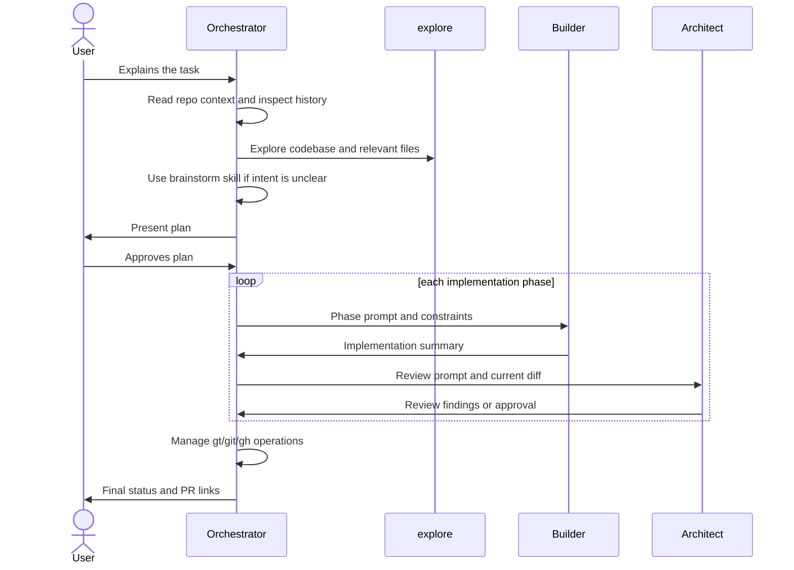

# Subagent Architecture

## Overview

The architecture has three layers:

- **Skills**: portable markdown describing how to do specific work well.
- **Agents**: OpenCode execution profiles with permissions and prompts.
- **Commands**: entry points that route a task to an agent.

The `orchestrator` owns the live working state. It gathers context, uses
brainstorming to clarify intent, produces the plan, and delegates implementation
and review to specialist subagents.

## Current agents

| Agent          | Mode     | Purpose                                                                    |
| -------------- | -------- | -------------------------------------------------------------------------- |
| `orchestrator` | primary  | Coordinates discovery, brainstorming, planning, and stacked implementation |
| `builder`      | subagent | Implements one phase of work                                               |
| `architect`    | subagent | Reviews one phase of work                                                  |

## Current skills

| Skill                         | Used by      | Purpose                                                    |
| ----------------------------- | ------------ | ---------------------------------------------------------- |
| `brainstorm`                  | Orchestrator | Clarify intent, scope, constraints, and success criteria   |
| `subagent-driven-development` | Orchestrator | Run implementation phases through Builder/Architect loops  |
| `code-review`                 | Architect    | Review a phase for correctness, regressions, and test gaps |

## Workflow

```mermaid
sequenceDiagram
    actor u as User
    participant o as Orchestrator
    participant e as explore
    participant b as Builder
    participant a as Architect

    u ->> o: Explains the task
    o ->> o: Read repo context and inspect history
    o ->> e: Explore codebase and relevant files
    o ->> o: Use brainstorm skill if intent is unclear
    o ->> u: Present plan
    u ->> o: Approves plan
    loop each implementation phase
        o ->> b: Phase prompt and constraints
        b ->> o: Implementation summary
        o ->> a: Review prompt and current diff
        a ->> o: Review findings or approval
    end
    o ->> o: Manage gt/git/gh operations
    o ->> u: Final status and PR links
```

## Conventions

- Skills are loaded by reference in agent prompts.
- The orchestrator keeps the working context compact.
- Builder handles edits; Architect handles review; Orchestrator handles flow
  control.
- The `explore` agent is used for discovery when a wide search is needed.
- Use `gt`, `git`, and `gh` from the orchestrator only.
